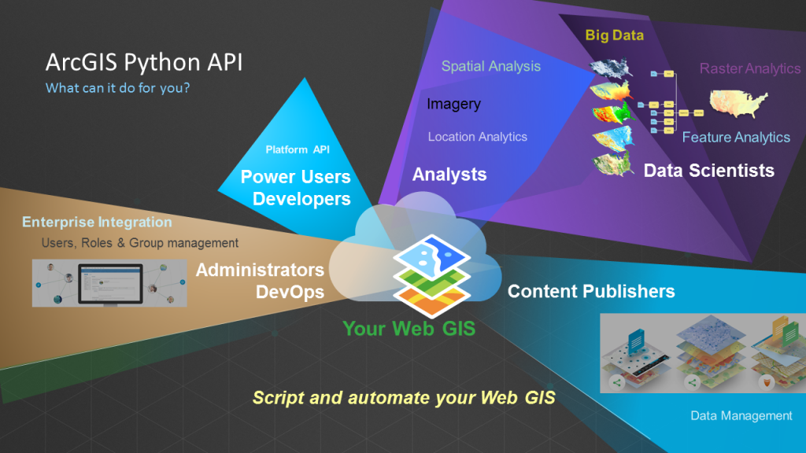

# ArcGIS API for Python

  

This image is retrieved from <a href="https://developers.arcgis.com/python/">ArcGIS for Developers website</a>.

## Objective & Purpose
The objective of this project is to use ArcGIS API for python to upload GIS resources to ArcGIS Online and publish it as a hosted feature layer. The purpose is streamline the workflow for such repetitive tasks. 

## How to run it locally
1. Make sure you have ArcGIS Pro installed on your local machine or have the environmental file that can run Arcpy. 
2. Clone this repo to your local machine.
3. Activate your environment and then open the **index.ipynb** to run the code. 
